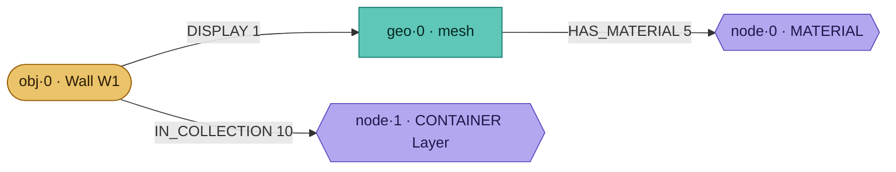
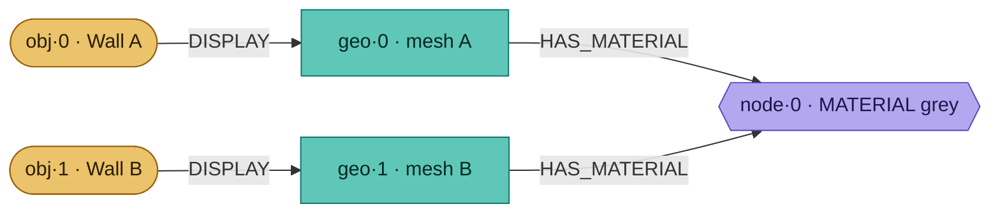
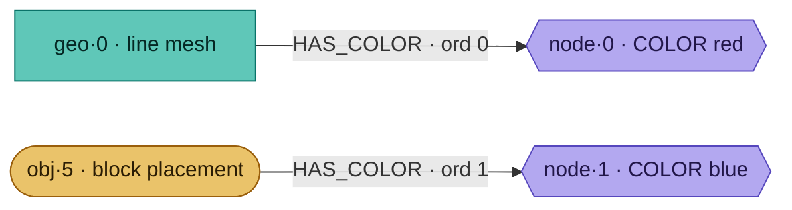
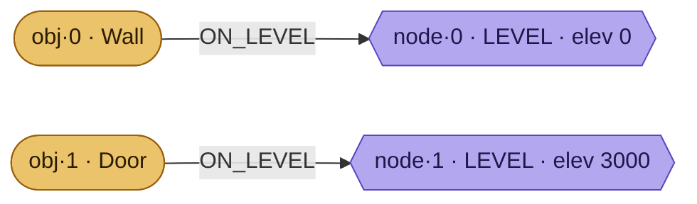
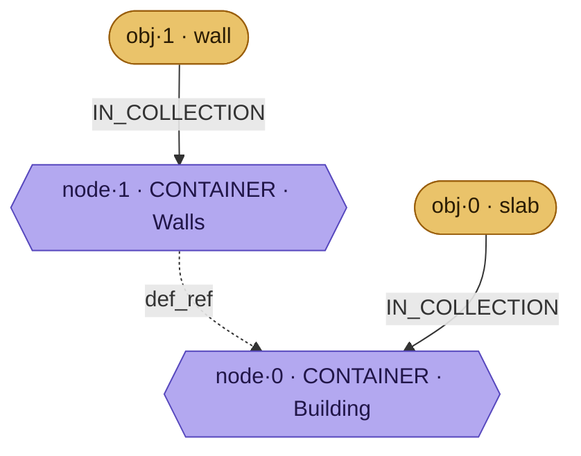
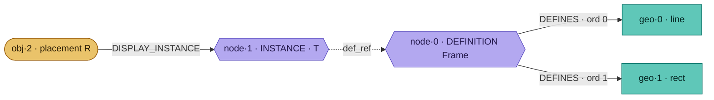
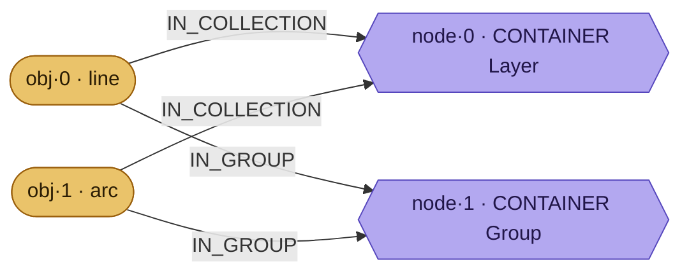
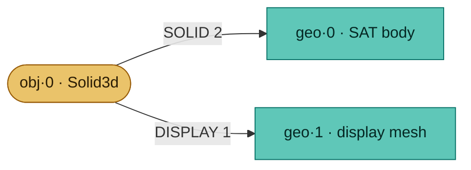
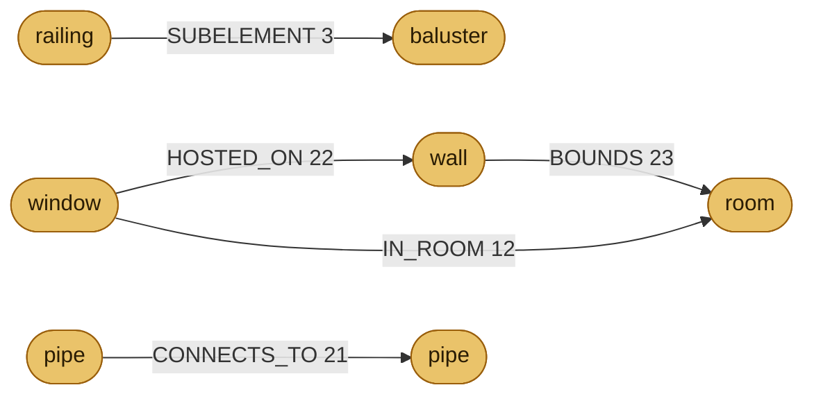

# The Speckle 4.0 artifact object model — a field guide

_Bundle spec · schema_version 5. Worked examples of each relation. See also: [relationships across every connector](./connector-relations.md)._

The 4.0 artifact bundle isn't a tree of nested objects like v1 `Base` — it's a **graph of flat parquet rows**, wired by typed edges across three independent ID spaces. You read an edge by knowing which space each end lives in.

## Three ID spaces, each counting from zero

A bare number is meaningless until you know its space. `obj·2`, `geo·2` and `node·2` are three unrelated things — this overlap is why the source namespace is load-bearing on every edge.

| space | lives in | what it identifies |
|---|---|---|
| **object** | `eav.objects` · `object_index` | a real source thing you drew or placed — wall, line, block placement, pipe. Identity + flattened properties. |
| **geometry** | `geometries` · `geometryIndex` | one blob — display mesh (SGEO) or lossless raw body (3dm / SAT). Content-interned. |
| **node** | `envelope.nodes` · `id` | a _synthetic_ value — material, color, level, block definition, instance, or container (layer / group / model / system). |

Reading an edge: `IN_COLLECTION: obj·0 → node·1` = "object 0 is grouped in container node 1". **The rel type fixes both namespaces**, so the same integer means different things on each side.

## The files (~14 parquet, three families)

Named `{version}.<family>.<table>.parquet`.

- **`eav.*`** — identity + flattened properties (the object space): `objects`, `paths`, `eav`, `types`, `type_eav`, `object_type`.
- **`geometries`** — the geometry space: SGEO mesh blobs + raw 3dm / SAT bodies, content-hash deduped, sharded on big models.
- **`envelope.*`** — the node space + the edges: `nodes`, `relations`, `rel_types` / `node_kinds` (self-describing catalogs), `meta`, `scene_views` / `camera_views`.

Plus the optional `eav.structural_results` purpose file.

---

## A plain object, fully assembled

A wall. Nothing is nested inside it — you reconstruct it by _following edges out of its object K_: to its mesh, to its layer, and the mesh onward to its material.

**Render loop:** for each object, walk `DISPLAY` to its meshes, each mesh's `HAS_MATERIAL` to its appearance, and `IN_COLLECTION` to its layer. No containment — pure edge-following.

## Materials — shared once, pointed at many times

Two walls with the same grey material. The material is _one_ node; both meshes point at it — the dedup.

`HAS_MATERIAL` flows _geometry → node_, not object → node. Material binds to the **mesh**, so a definition's shared geometry carries its material into every placement automatically.

## Colors — the one edge with two source spaces

A by-object display color binds to _geometry_. But a block _placement_ owns no geometry of its own, so its instance color binds to the _object_. Same rel, two source namespaces — the edge's `ord` column tags which (0 = geometry, 1 = object).

Without the `ord` tag, `obj·5` and `geo·5` are indistinguishable and the color lands on the wrong element (ENG-8822). COLOR is a distinct viewer render mode — an object can carry a full material _and_ a color override at once.

## Levels — a storey is a node, membership is an edge

Revit. The level is a LEVEL node with `elevation`; every object on it points there.

**Grouping is projected, not baked.** The scene tree "Level → Category → Family" isn't stored as folders — it's a recipe in `scene_views`: group by the ON_LEVEL edge, then by the `category` / `family` eav properties. Only the Level tier is a relation.

## Nested layers — membership is an edge, nesting is a column

Rhino, where layers nest. The **object → its layer** is the `IN_COLLECTION` edge; the **layer → its parent layer** is the `def_ref` pointer _on the container node itself_.

A layer isn't its own node kind. It's a CONTAINER with `subtype = "Layer"` — the same node kind that carries groups, models and systems, differing only by subtype. AutoCAD's flat layers are just containers with `def_ref = null`.

## Blocks & instances — geometry owned once, placed many times

A DEFINITION owns the shared geometry; each placement is an INSTANCE node carrying a transform and pointing back at the definition.

Members have **no `DISPLAY` and no `IN_COLLECTION`** — deliberate suppression, otherwise they'd draw untransformed at the origin (ENG-8782). A placement's transform composes onto the definition's geometry at receive. `DEFINES_INSTANCE` (node → node) handles a block nested inside another block.

## Groups — a second, overlapping axis

A group is a CONTAINER with `subtype = "Group"`. Unlike a layer, this axis _overlaps_: an object keeps its layer AND sits in one or more groups.

The receiver stores `IN_COLLECTION` last-wins — it _is_ the scene tree, single-valued. Groups are a separate multi-valued axis, so they needed their own rel.

## Solids — two geometries for one object

A Brep / Solid3d ships _both_ a lossless raw body (same-host round trip) and a tessellated display mesh (viewer / foreign hosts).

Receive prefers the solid, falls back to the mesh — a Rhino model received into AutoCAD can't read a foreign 3dm, so it uses the DISPLAY mesh (ENG-8820).

## Topology — edges between real objects

Not everything routes through a synthetic node. A whole family connects _object to object_ directly.

Rooms are _objects_, not nodes — so `IN_ROOM` and `BOUNDS` point at an object K, in contrast with `IN_SYSTEM`/`IN_GROUP` which point at synthetic container nodes.

---

## The member-layer gap

A definition member reaches the bundle _only_ as a **geometry** K, via `DEFINES`. It has no `DISPLAY` edge — so there is no path from its geometry K back to its object K — and no `IN_COLLECTION`, so it carries no layer at all.

`IN_COLLECTION` can't reach it: that rel is _object_-sourced, and the member is only addressable as geometry. Adding it would also wrongly place the member in the scene tree (a phantom node). The shape that fits is a proposed **`ON_LAYER` · geometry → node** — the geometry-sourced sibling of `ON_LEVEL`. It would say only "this geometry's host layer is X" without asserting scene-tree membership, letting a receiver set the member's layer + `ByLayer` colour by inheritance. The limit: it fixes layer-shaped attributes only; per-member _properties_ still need member-object identity carried through `DEFINES`.

---

_The model in one line: **flat rows in three ID spaces, wired by typed edges whose namespaces are fixed.** Understanding = knowing which space each number is in and following the edges._
