# Relationships across every connector — a source of truth

_Speckle 4.0 artifact bundle · schema_version 5 · verified against connector send builders on `big-truck` + the SketchUp Ruby producer._

The [bundle spec](https://github.com/specklesystems/speckle-bundle-spec) defines **17 live relations**, but no connector emits all of them. Each host maps its own concepts (layers, levels, blocks, systems, results) onto the subset that fits. This doc pins down, with diagrams and code evidence, exactly what **every connector** produces and consumes.

> Companion: [the artifact object model field guide](./artifact-object-model.md) — worked examples of each relation in the abstract.

---

## Part 1 · the vocabulary

A bundle is a graph of flat parquet rows across **three ID spaces**. A bare number is meaningless until you know its space — `obj·2`, `geo·2` and `node·2` are three unrelated things. Every relation is a typed edge; the rel type fixes which space each end lives in.

| space | lives in | identifies |
|---|---|---|
| **object** | `eav.objects` · `object_index` | a real source thing — wall, line, block placement, pipe, frame member |
| **geometry** | `geometries` · `geometryIndex` | one blob — display mesh (SGEO) or lossless raw body (3dm / SAT) |
| **node** | `envelope.nodes` · `id` | a synthetic value — material, color, level, definition, instance, container |

### The 17 live relations

| id | relation | src → dst | meaning |
|---:|---|---|---|
| 1 | `DISPLAY` | object → geometry | object's own display mesh |
| 2 | `SOLID` | object → geometry | lossless raw body (3dm / SAT) |
| 3 | `SUBELEMENT` | object → object | parent owns child (railing→baluster, corridor→region) |
| 4 | `DEFINES` | node → geometry | DEFINITION owns shared geometry |
| 5 | `HAS_MATERIAL` | geometry → node | mesh → MATERIAL (full PBR) |
| 6 | `HAS_COLOR` | geometry \| object → node | display color · `ord` tags the src namespace |
| 7 | `ON_LEVEL` | object → node | object → LEVEL (storey, with elevation) |
| 8 | `DISPLAY_INSTANCE` | object → node | placement → INSTANCE (transform + def) |
| 9 | `DEFINES_INSTANCE` | node → node | definition → nested INSTANCE (block-in-block) |
| 10 | `IN_COLLECTION` | object → node | object → CONTAINER (layer / tag / by-type) |
| 11 | `IN_MODEL` | object → node | object → CONTAINER (source file · federation) |
| 12 | `IN_ROOM` | object → object | object occupies a room |
| 14 | `IN_SYSTEM` | object → node | object → CONTAINER (MEP system / network) |
| 17 | `IN_GROUP` | object → node | object → CONTAINER (group) · overlapping axis |
| 21 | `CONNECTS_TO` | object → object | directed connectivity (frame→joint, pipe→structure, room adjacency) |
| 22 | `HOSTED_ON` | object → object | hosted element → host (managed Revit folds into SUBELEMENT) |
| 23 | `BOUNDS` | object → object | bounding wall → room |

Plus four **value / sidecar files** outside the relation graph: `camera_views` (named viewpoints), `structural_results` (analysis rows), `reference_point` (meta columns), and the Civil3D **property-set definitions carrier**.

**Node kinds:** DEFINITION, INSTANCE, MATERIAL, COLOR, LEVEL, and the polymorphic **CONTAINER** (subtype = Layer / Group / Model / MEP System / Network / Collection / Folder).

---

## Part 2 · connector × relationship matrix

What each connector actually emits, verified in the send builders. `●` emitted · `◐` conditional / folded / wired-dead · `·` not emitted.

| relation | Rhino | GH | ACAD | Plant3D | Civil3D | SketchUp | Revit | Tekla | CSi | TSD |
|---|:-:|:-:|:-:|:-:|:-:|:-:|:-:|:-:|:-:|:-:|
| **1 DISPLAY** | ● | ● | ● | ● | ● | ● | ● | ● | ● | ● |
| **2 SOLID** | ● | ● | ● | ● | ● | · | · | · | · | · |
| **5 HAS_MATERIAL** | ● | ● | ● | ● | ● | ● | ● | ● | · | · |
| **6 HAS_COLOR** | ● | ● | ● | ● | ● | ● | · | · | · | · |
| **4 DEFINES** | ● | ● | ● | ● | ● | ● | ● | · | · | · |
| **8 DISPLAY_INSTANCE** | ● | ● | ● | ● | ● | ● | ● | · | · | · |
| **9 DEFINES_INSTANCE** | ● | ● | ● | ● | ● | ● | · | · | · | · |
| **10 IN_COLLECTION** | ● | ● | ● | ● | ● | ● | · | ● | ● | ● |
| **11 IN_MODEL** | · | · | · | · | · | · | ● | · | · | · |
| **7 ON_LEVEL** | · | · | · | · | · | · | ● | · | · | · |
| **17 IN_GROUP** | ● | · | ● | · | ● | · | · | · | · | · |
| **3 SUBELEMENT** | · | · | · | · | ● | · | ● | ● | · | ◐¹ |
| **14 IN_SYSTEM** | · | · | · | · | ● | · | · | · | · | · |
| **12 IN_ROOM** | · | · | · | · | · | · | ● | · | · | · |
| **21 CONNECTS_TO** | · | · | · | · | ● | · | ● | · | ● | · |
| **22 HOSTED_ON** | · | · | · | · | · | · | ◐² | · | · | · |
| **23 BOUNDS** | · | · | · | · | · | · | ◐³ | · | · | · |
| _camera_views_ | ● | · | · | · | · | ● | ● | · | · | · |
| _structural_results_ | · | · | · | · | · | · | · | · | ● | ● |
| _reference_point (meta)_ | · | · | · | · | · | · | ● | · | · | · |
| _property-set carrier_ | · | · | · | · | ● | · | · | · | · | · |
| **native receive** | ● | · | ● | · | ● | ● | ● | · | · | · |

¹ TSD `SUBELEMENT` is wired but unreachable — `elements` is always empty.
² Revit folds `HOSTED_ON` into `SUBELEMENT` (managed builder reuses the richer rel).
³ Revit folds `BOUNDS` into `IN_ROOM`.

Civil3D's `SUBELEMENT`/`IN_SYSTEM`/`CONNECTS_TO` emitters live in the shared AutoCAD builder but only fire for `Civil3dObject`s — so **AutoCAD & Plant3D never produce them**. Plant3D is send-only. SketchUp is a pure-Ruby producer.

---

## Part 3 · every connector, up close

### Rhino — CAD · free-form · emits 9

A layer-tree scene: every object hangs off its (nested) Rhino layer, with display meshes and a lossless raw-3dm solid alongside, block instancing, materials, by-object colours, and native groups as a second overlapping axis.

**Atomic solid** — `DISPLAY` · `SOLID` · `HAS_MATERIAL` · `HAS_COLOR` · `IN_COLLECTION`

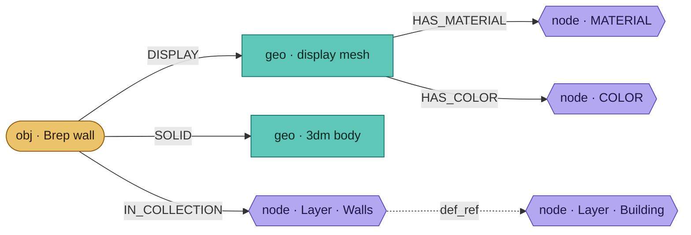

A Brep carries both a raw 3dm SOLID (lossless Rhino→Rhino) and DISPLAY meshes (viewer); material & colour bind to the mesh; the layer nests via the container's `def_ref`.

**Block instancing** — `DISPLAY_INSTANCE` · `DEFINES` · `DEFINES_INSTANCE`

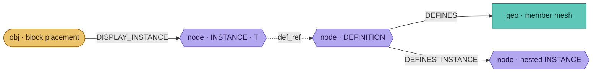

A placement points at an INSTANCE (transform) that references a DEFINITION; the definition owns its geometry and can nest another block placement. Members get no top-level edges (ENG-8782).

**Groups overlap layers** — `IN_COLLECTION` · `IN_GROUP`

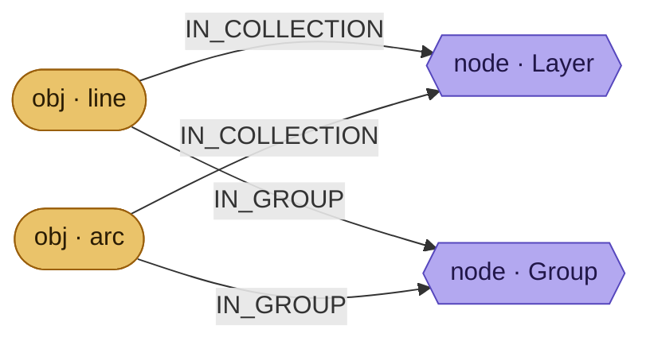

An object keeps its layer AND its group(s) — separate axes. Instance colours are object-sourced (ENG-8822/8825).

- **Nodes:** CONTAINER `"Layer"` (nested) · `"Group"` · DEFINITION/INSTANCE · MATERIAL · COLOR · raw 3dm SOLID
- **Sidecar:** `camera_views` ← named views (persp + ortho)
- **Receive:** ● native — layers, groups, instances, materials, colours, SOLID→DISPLAY fallback
- **Watch out:** two-phase threading (RhinoCommon UI-affine); hatches serialize to 3dm + eav pattern

---

### Grasshopper — CAD · computational · emits 8

The Rhino geometry set minus groups: each collection — including one per data-tree branch — becomes a nested CONTAINER, with instancing, materials and colours resolved the same way.

**Data trees → collections** — `DISPLAY` · `IN_COLLECTION` + eav sidecar

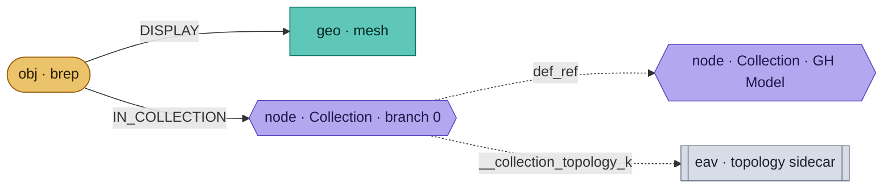

Every GH branch maps to one CONTAINER; the exact path array rides a sidecar eav object (`__collection_topology_{k}`) so receivers rebuild the tree with no schema change. GH reuses Rhino's geometry/material/color/block packers verbatim — no layer or level concept.

- **Nodes:** CONTAINER `"Collection"` (nested, one per branch) · DEFINITION/INSTANCE · MATERIAL · COLOR
- **Receive:** send-only (data connector)

---

### AutoCAD — CAD · drafting · emits 9

Entities onto a flat layer namespace, with lossless ACIS-SAT solids alongside display meshes, block instancing, materials, ByBlock/ByLayer-aware colours, and authored groups.

**Solid3d, flat layers** — `DISPLAY` · `SOLID` · `HAS_COLOR` · `IN_COLLECTION`

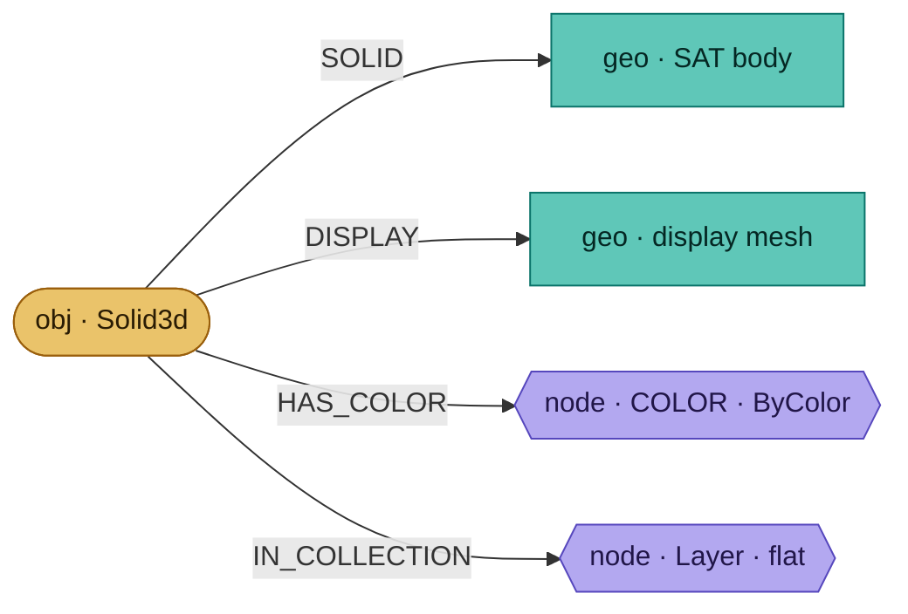

The ACIS-SAT blob is the lossless SOLID; layers are single top-level CONTAINERs (no nesting), colour on the layer's `argb`. A member's SAT rides DEFINES so the block reconstructs a native Solid3d (ENG-8855). Receive prefers SAT, falls back to the mesh (ENG-8820); ByBlock members inherit the placement (ENG-8822/8825).

- **Nodes:** CONTAINER `"Layer"` (flat) · `"Group"` · DEFINITION/INSTANCE · MATERIAL · COLOR · raw SAT SOLID
- **Receive:** ● native — SAT→DISPLAY fallback, groups, ByBlock/ByLayer colour
- **Watch out:** per-object doc-TM transactions (other variants hang / lose objects on AutoCAD 2023)

---

### Plant3D — CAD · vertical · send-only

No builder of its own — reuses AutoCAD's send path verbatim. Same 9 relations, same node shapes as AutoCAD, nothing Plant3D-specific on the 4.0 path. Registers the shared AutoCAD `IArtifactRootObjectBuilder`; its own root builder is legacy-v1 only. P&ID / spec-driven data survives as eav properties, not as dedicated relations. **No receive path is registered** — any Plant3D-native round-trip needs a dedicated receive builder (doesn't exist yet).

---

### Civil3D — CAD · infrastructure · emits 12

The AutoCAD base plus three infrastructure layers: a SUBELEMENT sub-object tree, pipe-network topology, and a property-set-definitions carrier for native round-trip.

**Composite sub-object tree** — `SUBELEMENT`

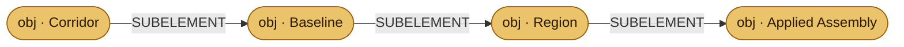

Corridor→baseline→region→assembly (also alignment→profiles, site→parcels/feature-lines). Each child is interned as a full object with its own DISPLAY + layer, then linked to its parent.

**Pipe networks** — `IN_SYSTEM` · `CONNECTS_TO`

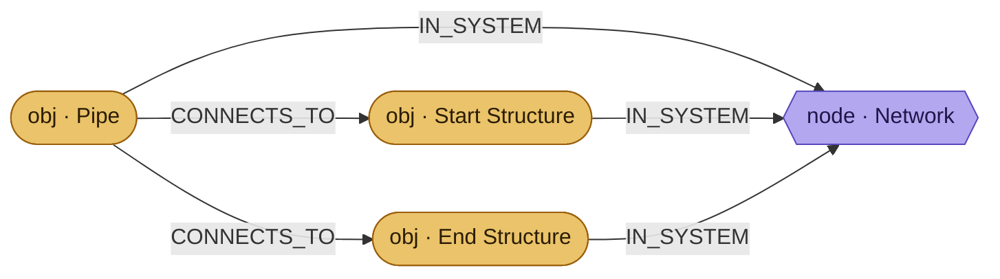

Parts join a CONTAINER(`"Network"`) via IN_SYSTEM; a pipe connects to its start/end structures via CONNECTS_TO (guarded to sent objects). Grounded in the part's `Assignments` property dict.

**Property sets round-trip** — carrier (eav)

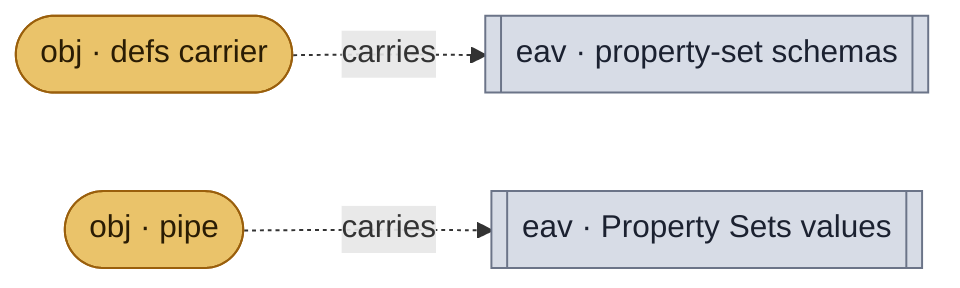

**Definitions** (schemas) ride one synthetic carrier object `speckle:civil3d:property-set-definitions`; per-object **values** ride normal eav. Receive recreates native sets and coerces values to each definition's data type (ENG-8834).

- **Nodes:** = AutoCAD + CONTAINER `"Network"` + property-set carrier object
- **Receive:** ● native — AutoCAD bake + recreates property sets (PostBakeEntity)
- **Watch out:** `SUBELEMENT`/`IN_SYSTEM`/`CONNECTS_TO` are **send-only** — children re-bake as flat layered entities; network topology survives in the graph, not the DWG

---

### SketchUp — CAD · conceptual · pure Ruby · emits 7

A pure-Ruby producer: components AND groups both become DEFINITION/INSTANCE, tags/folders become CONTAINERs, tag colours ride HAS_COLOR, faces/edges ride DISPLAY.

**Components, groups & tags** — `DISPLAY_INSTANCE` · `DEFINES` · `IN_COLLECTION`

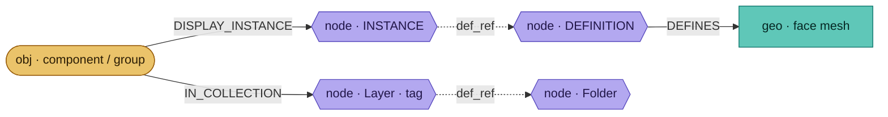

A SketchUp group emits DISPLAY_INSTANCE like a component — so **IN_GROUP is never produced**. Tags map to CONTAINER(`"Layer"`) nested under `"Folder"`. Beyond the material, each object also gets a COLOR node from its tag colour (colour-by-tag, memoized per layer).

- **Nodes:** CONTAINER `"Layer"` (tag) & `"Folder"` · DEFINITION/INSTANCE · MATERIAL · COLOR
- **Sidecar:** `camera_views` ← SketchUp scenes (pages)
- **Receive:** ● native (Ruby)
- **Watch out:** full vocab present in the Ruby catalog, but solid/subelement/on_level/in_model methods are dormant

---

### Revit — BIM · emits 9

The richest BIM producer: display geometry + instances/materials/levels, per-document model containers for federation, and a best-effort host-API topology layer (sub-elements, rooms, room-adjacency).

**Wall on a level** — `DISPLAY` · `HAS_MATERIAL` · `ON_LEVEL` · `IN_MODEL`

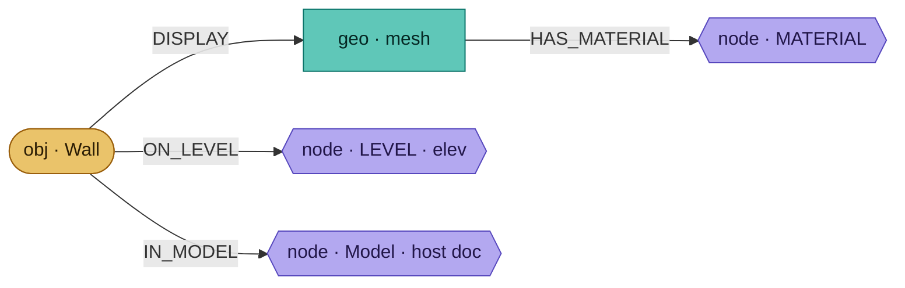

The tree is **Model → Level → Category → Family** — only the Model & Level tiers are relations; Category/Family are eav properties projected by `scene_views`. Model tier appears only when >1 document.

**Family instances** — `DISPLAY_INSTANCE` · `DEFINES`

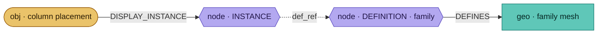

Repeated families place one DEFINITION many times; receive uses a DirectShapeLibrary geometry instance per DISPLAY_INSTANCE rather than re-tessellating.

**Hosting & rooms** — `SUBELEMENT` (← folds `HOSTED_ON`) · `IN_ROOM` (← folds `BOUNDS`) · `CONNECTS_TO`

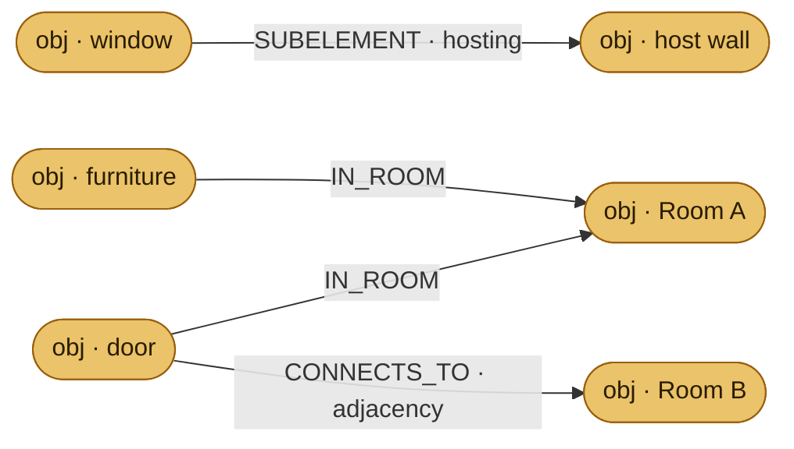

The managed builder reuses `SUBELEMENT` for both ownership and hosting (window→wall) rather than emitting the rvextract-only `HOSTED_ON`. Occupancy is `IN_ROOM` (rooms are _objects_, not nodes); a door's FromRoom→ToRoom becomes `CONNECTS_TO` scoped by the opening. All best-effort in try/catch — topology never fails the geometry send.

- **Nodes:** CONTAINER `"Model"` (per source doc) · LEVEL (name+elev) · DEFINITION/INSTANCE · MATERIAL
- **Sidecar:** `camera_views` ← 3D views (ENG-8802) · `reference_point` meta (ENG-8808)
- **Receive:** ● native — DirectShape + DirectShapeLibrary instances, reference-point reversal
- **Watch out:** linked models intern per-placement; Shared Coordinates deliberately not recorded (can't be one offset)

---

### Tekla Structures — structural · detailing · emits 4

A flat by-type scene of tessellated detailing objects (parts, plates, bolts, rebar), with nested elements wired to their owner via SUBELEMENT and Tekla visualisation colours as materials.

**Assembly / part tree** — `SUBELEMENT` · `DISPLAY` · `HAS_MATERIAL` · `IN_COLLECTION`

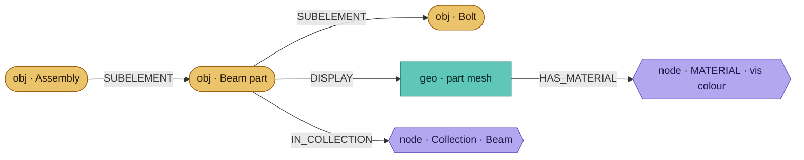

Every object (owner and child) lands in a flat by-type collection AND is wired into a SUBELEMENT tree; each child is a first-class object with its own geometry + material. Material is the Tekla _visualisation colour_, per-mesh.

- **Nodes:** CONTAINER `"Collection"` (by object type — Beam, ContourPlate…) · MATERIAL
- **Receive:** send-only
- **Watch out:** grouping is by object type only — no class/phase/section sub-grouping yet (TODO). Rebar-as-solid is a toggle but always DISPLAY

---

### CSi · ETABS · SAP — structural · analysis · emits 3

The analysis model as display-only geometry in a nested scene tree, plus a member↔joint connectivity graph and a flat table of analysis result rows — the primary `structural_results` producer.

**Connectivity graph** — `CONNECTS_TO` · `IN_COLLECTION`

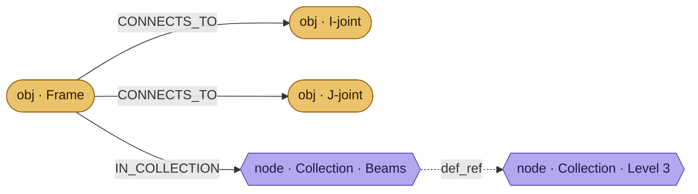

A frame connects to its I/J-end joints (the slab↔beam↔column graph via shared joints). ETABS groups **level → category**; **stories are Collections, not LEVEL nodes**.

**Analysis results** — `structural_results`

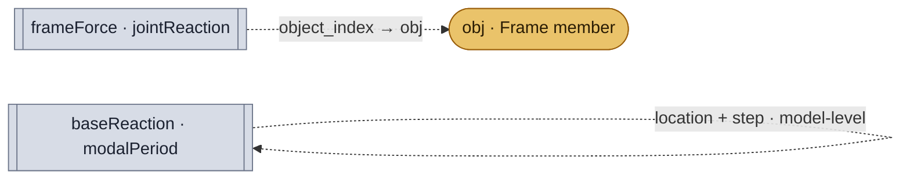

Object-level rows (frameForce, jointReaction) join back via `object_index`; model-level rows (baseReaction, modalPeriod) have null object and key by location/step. Pier/spandrel/story results are extracted but not yet flattened.

- **Nodes:** CONTAINER `"Collection"` — ETABS level→category; base CSi/SAP flat by-type
- **Sidecar:** `structural_results` — frame/joint (object) · base/modal (model)
- **Receive:** send-only
- **Watch out:** results gate on a **locked/analysed** model; a results failure never fails the geometry send. Sections/materials stay in eav (deferred)

---

### TSD — structural · design · emits 2

A flat structural model — members grouped by member-type, slabs, walls — with mesh display geometry and a separate stream of numeric-only analysis results.

**Flat model + results** — `DISPLAY` · `IN_COLLECTION` · `structural_results`

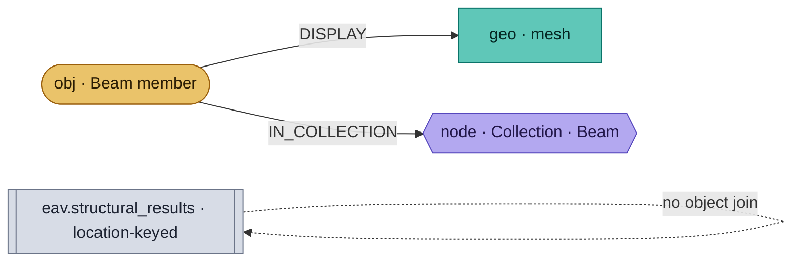

Members group by member-type (Beam, Column, Slab…) into flat collections. Results are **model-level (location-keyed)** — `ObjectAppId` always null — so they identify members by name, not by object K, and don't auto-join. Numeric only, no PASS/FAIL.

- **Nodes:** CONTAINER `"Collection"` (flat, by MemberType)
- **Sidecar:** `structural_results` — forces / reactions / displacements, model-level
- **Receive:** send-only
- **Watch out:** `SUBELEMENT` is wired but **unreachable** (elements always empty) — scaffolding for future child modeling

---

## Part 4 · patterns, design calls & gaps

**Three families.**
- _Free-form CAD_ (Rhino, GH, AutoCAD, Plant3D, SketchUp) shares one profile: DISPLAY + instancing + IN_COLLECTION + materials/colours, ± groups & solids.
- _BIM_ (Revit) is the only user of ON_LEVEL, IN_MODEL and IN_ROOM — the storey/federation/spatial tier.
- _Structural_ (Tekla, CSi, TSD) is lean geometry + one topology or results channel; CSi & TSD own `structural_results`.

**Deliberate folds & substitutions.**
- Revit **folds HOSTED_ON into SUBELEMENT** and **BOUNDS into IN_ROOM** — reuses richer rels rather than emit the rvextract-only pair.
- SketchUp maps **groups to component instances**, so it never emits IN_GROUP. CSi maps **stories to Collections**, not LEVEL nodes.
- The spec's `emitted_by` hint (`rvextract`/`nwextract`/`managed`) is coarse — this map is the precise managed-connector truth.

**Known gaps.**
- **Civil3D topology is send-only** — SUBELEMENT/IN_SYSTEM/CONNECTS_TO survive in the graph but aren't rebuilt as native Civil relationships on receive.
- **TSD SUBELEMENT is dead code** (elements always empty); **TSD results don't object-join** (location-keyed).
- The member-layer gap (definition members carry no layer) is still open — a proposed geometry-sourced `ON_LAYER` edge would close it.

---

_Catalogs are self-describing — read `rel_types` & `node_kinds` from any bundle for the live truth. This map reflects what each builder emits today; update it in the same PR when a builder changes._
